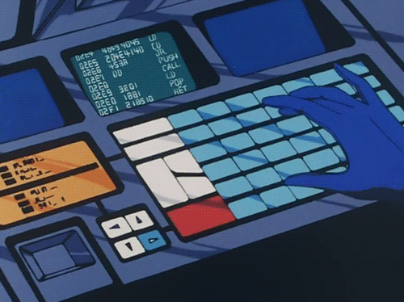

###          <!--  -->   “A person often meets [their] destiny on the road [they] took to avoid it.”  “The ultimate, hidden truth of the world is that it is something &nbsp;&nbsp;that we make, and could just as easily make differently.”  

<!--

“The future is certain; it is only the past that is unpredictable.”
  <a href="https://www.linkedin.com/in/will-clingan-3b1b95111/">LinkedIn profile</a>
   
-->
